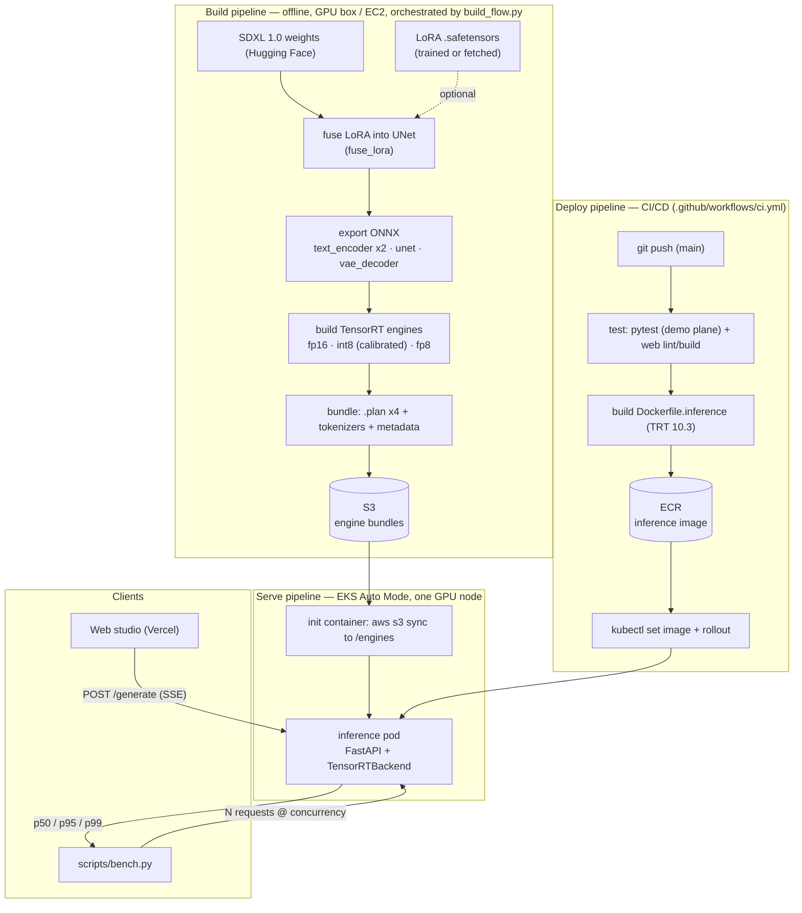
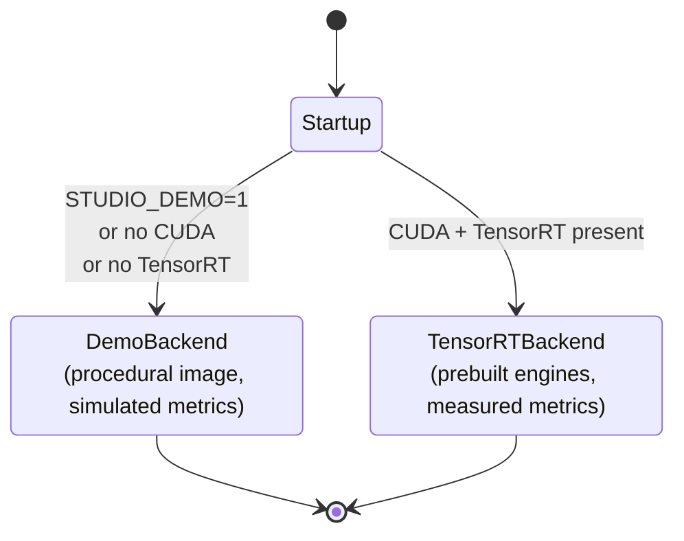
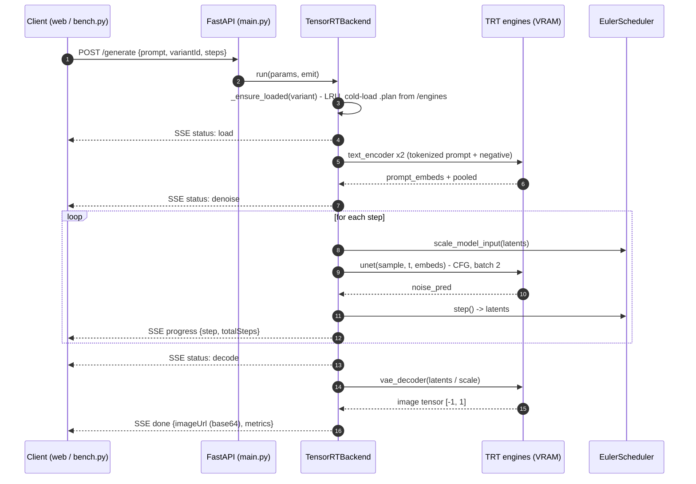
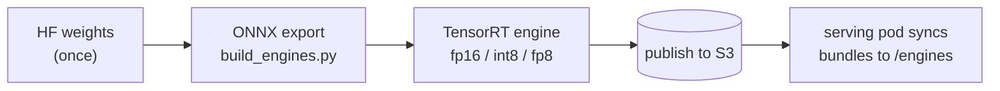

# ptq-gpu

Benchmarking the p95 latency, VRAM, and quality tradeoff of quantised SDXL — served as TensorRT engines on real GPU hardware.

#### [Live demo](https://ptq-gpu.vercel.app)

> [!NOTE]
> The **demo plane** runs the entire studio on CPU with **zero GPUs** — `docker compose up` and go. GPUs are only needed to build engines and to serve/benchmark the real (TensorRT) plane.

> [!WARNING]
> **Status:** the **FP16** variants are validated end-to-end (build → serve → correct image → benchmark). **INT8** (entropy calibration) and **FP8** (ModelOpt Q/DQ) are in progress and currently build as FP16 fallbacks, so their latency numbers aren't yet distinct. The demo plane is what CI exercises.

# Table of contents

[Overview](#overview)

[How it works](#how-it-works)

- [Two planes](#two-planes)
- [Serving](#serving)
- [Build pipeline](#build-pipeline)
- [Infrastructure](#infrastructure)

[Variants](#variants)

[Running locally](#running-locally)

- [Requirements](#requirements)
- [Demo plane](#demo-plane)
- [Tests](#tests)

[Building engines](#building-engines)

[Deploying to EKS](#deploying-to-eks)

[Benchmarking](#benchmarking)

[Repository layout](#repository-layout)

[License](#license)

[Authors](#authors)

[Credits](#credits)

[back to top](#readme-top)

---

## Overview

**ptq-gpu** exists to answer one question with real numbers: *what does quantising
SDXL actually cost you, and what does it buy?* It serves the same SDXL 1.0 model as
a matrix of **precision × style** TensorRT engines — FP16, INT8, FP8, each as Base
or LoRA — and measures the tradeoff for each on **consistent, dedicated GPU
hardware**: p50/p95/p99 latency, peak VRAM, and quality.

Latency is the deliverable, so two things matter:

- **The engines are prebuilt TensorRT `.plan` files.** There is no Hugging Face or
`diffusers` at serving time — the text encoders, UNet, and VAE run as engines and
the scheduler is vendored. That strips framework overhead out of the measurement.
- **It runs on a pinned GPU (EKS), not a serverless pool.** One dedicated card gives
reproducible p95 instead of run-to-run allocation variance.

A web studio (studio + compare pages) streams generations over SSE and renders the
metrics side by side; `scripts/bench.py` produces the percentile tables.

[back to top](#readme-top)

---

## How it works

The system is four stages — **build** engines offline, **deploy** the image via
CI/CD, **serve** on a pinned GPU, and **benchmark**:




### Two planes

The service picks its backend at startup, so the exact same product runs with or
without a GPU:


| Plane    | When                        | Backend                                       | GPU  |
| -------- | --------------------------- | --------------------------------------------- | ---- |
| **demo** | no CUDA, or `STUDIO_DEMO=1` | seeded procedural renderer, simulated metrics | none |
| **real** | CUDA + TensorRT present     | prebuilt TRT engines, measured metrics        | yes  |


The demo plane makes the whole frontend exercisable in local dev and CI; its
metrics are derived from the registry and clearly logged as simulated. The backend
is chosen once at startup:




### Serving

`inference/` is a FastAPI service exposing three endpoints — `GET /variants`,
`POST /generate` (SSE), and `GET /healthz`. `TensorRTBackend` keeps an LRU set of
engine bundles hot in VRAM (`max_resident`), runs the denoise loop, and measures
cold-load / denoise / VAE latency, throughput, and peak VRAM around the real work.
Engine bundles are synced from S3 into the pod by an init container — nothing is
downloaded from Hugging Face at request time. A single `POST /generate` on the
real plane flows like this:




### Build pipeline

`pipelines/` turns the base checkpoint into the servable engines. This is offline
and **not** latency-critical, so it can run anywhere with a GPU:



`build_flow.py` (Metaflow + Ray) orchestrates train-LoRA → build → benchmark on any
CUDA GPU. Only the UNet is quantised; the VAE (fp16-fix) and text encoders stay FP16.

### Infrastructure

Serving runs on **EKS Auto Mode**: a NodePool provisions a single GPU node, the
inference pod syncs its engines from S3 on startup (S3 read via **Pod Identity**),
and it's reached over a ClusterIP service — port-forwarded for benchmarking, or
fronted by the ALB + TLS ingress (`infra/ingress.yaml`) for a public domain. One
dedicated card = reproducible latency. The web app is hosted separately on Vercel.

[back to top](#readme-top)

---

## Variants

The precision × style matrix served by `GET /variants`. Numbers are the target
tradeoff on a single L40S (the build flow measures and syncs them into
`inference/variants.yaml`):


| Variant     | Precision | Style | Size    | Peak VRAM | Throughput | Quality | Status             |
| ----------- | --------- | ----- | ------- | --------- | ---------- | ------- | ------------------ |
| FP16 · Base | FP16      | Base  | 13.0 GB | 18.4 GB   | 7.8 it/s   | 98      | ✅ validated        |
| FP16 · LoRA | FP16      | LoRA  | 13.2 GB | 18.7 GB   | 7.6 it/s   | 97      | ✅ validated        |
| INT8 · Base | INT8      | Base  | 7.1 GB  | 11.2 GB   | 12.6 it/s  | 95      | 🚧 calibration WIP |
| FP8 · Base  | FP8       | Base  | 6.6 GB  | 9.6 GB    | 16.4 it/s  | 92      | 🚧 needs ModelOpt  |
| FP8 · LoRA  | FP8       | LoRA  | 6.8 GB  | 9.9 GB    | 15.8 it/s  | 90      | 🚧 needs ModelOpt  |


> [!NOTE]
> Only the UNet is quantised; the VAE and text encoders stay FP16. `quality` is a
> CLIP image-text score normalised against FP16 — i.e. *fidelity retained vs FP16*.

[back to top](#readme-top)

---

## Running locally

### Requirements

- Docker (for the one-command demo), or Python 3.11 + Node 20 / pnpm for dev.
- **No GPU and no model downloads** are needed for anything in this section.

### Demo plane

The fastest path — inference (demo) + web, on CPU:

```bash
docker compose -f docker/docker-compose.yml up --build
# open http://localhost:3000
```

Or run the two services directly:

```bash
# inference (demo plane)
cd inference && pip install -r requirements.txt
STUDIO_DEMO=1 uvicorn main:app --port 8000

# web
cd web && pnpm install && pnpm dev   # http://localhost:3000
```

If the API is unreachable, the studio transparently falls back to in-browser demo
data, so the frontend is always usable.

### Tests

```bash
cd inference && STUDIO_DEMO=1 pytest -q     # API + smoke tests (demo plane)
cd web && pnpm lint && pnpm build           # lint + typecheck + build
```

[back to top](#readme-top)

---

## Building engines

Build the engines once on a GPU box (an EC2 GPU instance, or a Job on the EKS GPU
node), publish to S3, then point the serving pod at the bucket. Building isn't
latency-sensitive, so any CUDA GPU works:

```bash
pip install -r pipelines/requirements.txt -r inference/requirements.txt -r inference/requirements-gpu.txt

# build every variant, publish .plan bundles to S3, sync measured metrics back
python pipelines/build_flow.py run --sync --engine-s3 s3://<bucket>
```

**LoRA** is fused into the engine at build time, so a pre-trained SDXL LoRA works
with no dataset — `./pipelines/fetch_lora.sh` grabs one, then build with `--skip-train`.
To train your own, add instance images under `pipelines/data/<name>/` (see
`pipelines/data/README.md`) and drop `--skip-train`.

> The build-time TensorRT version **must match** the serving runtime (both 10.3),
> since `.plan` engines aren't portable across major versions.

[back to top](#readme-top)

---

## Deploying to EKS

Serving runs on **EKS Auto Mode** for pinned, reproducible latency. CI builds the
inference image, pushes to ECR, and rolls out the deployment. Full bring-up is in
`[infra/README.md](infra/README.md)`; the essentials:

```bash
# 1. GPU node (Auto Mode NodePool) + the inference ServiceAccount
kubectl apply -f infra/k8s/gpu-nodepool.yaml

# 2. S3 read for the engine sync (EKS Pod Identity)
aws iam create-role --role-name ptq-gpu-inference-s3 \
  --assume-role-policy-document file://infra/aws/inference-s3-trust.json
aws iam put-role-policy --role-name ptq-gpu-inference-s3 --policy-name s3-read \
  --policy-document file://infra/aws/inference-s3-policy.json
aws eks create-pod-identity-association --cluster-name <cluster> \
  --namespace quant-studio --service-account inference --role-arn <role-arn>

# 3. push → CI builds the inference image → ECR → deploy + rollout
git push
```

> [!IMPORTANT]
> Launching GPU instances needs a non-zero **G-class vCPU quota** (`L-DB2E81BA`).
> Fresh AWS accounts start at **0** — request an increase (8 vCPUs = one `.2xlarge`
> = one GPU, which is all this project needs) before the pod can schedule.

`eksctl-cluster.yaml` + `bootstrap.sh` are an alternative managed-nodegroup path if
you're not on Auto Mode.

[back to top](#readme-top)

---

## Benchmarking

The whole point — `scripts/bench.py` fires N generations per variant at a chosen
concurrency and reports p50/p95/p99 of both the end-to-end wall time and the
server-measured denoise time (network-independent):

```bash
kubectl -n quant-studio port-forward svc/inference 8000:80 &
python3 scripts/bench.py http://localhost:8000 --variants fp16-base,int8-base -n 50 -c 4
```

```text
variant        n   cold   wall p50   p95   p99   denoise p50   p95    vram
fp16-base     50   4200      2100  2400  2600         1850  1980    18.4
int8-base     50   3100      1400  1600  1750         1180  1290    11.2
```

Concurrency (`-c`) drives load so p95/p99 reflect real queueing, not a quiet single
stream. Read the **denoise** columns for hardware-clean numbers — `wall` includes
network (port-forward adds jitter; run from inside the VPC for a clean wall-clock).
`scripts/generate.py` is a one-shot generate-and-save for a quick endpoint check.

[back to top](#readme-top)

---

## License

Distributed under the MIT License. See `[LICENSE](LICENSE)` for details.

## Authors

- **Aqil Marwan** — [@aqilmarwan](https://github.com/aqilmarwan)

## Credits

- [Stable Diffusion XL](https://huggingface.co/stabilityai/stable-diffusion-xl-base-1.0) — Stability AI
- [TensorRT](https://developer.nvidia.com/tensorrt) · [diffusers](https://github.com/huggingface/diffusers) · [FastAPI](https://fastapi.tiangolo.com/) · [Next.js](https://nextjs.org/)
- [sdxl-vae-fp16-fix](https://huggingface.co/madebyollin/sdxl-vae-fp16-fix) · Cyberpunk SDXL LoRA — [issaccyj/lora-sdxl-cyberpunk](https://huggingface.co/issaccyj/lora-sdxl-cyberpunk)

[back to top](#readme-top)