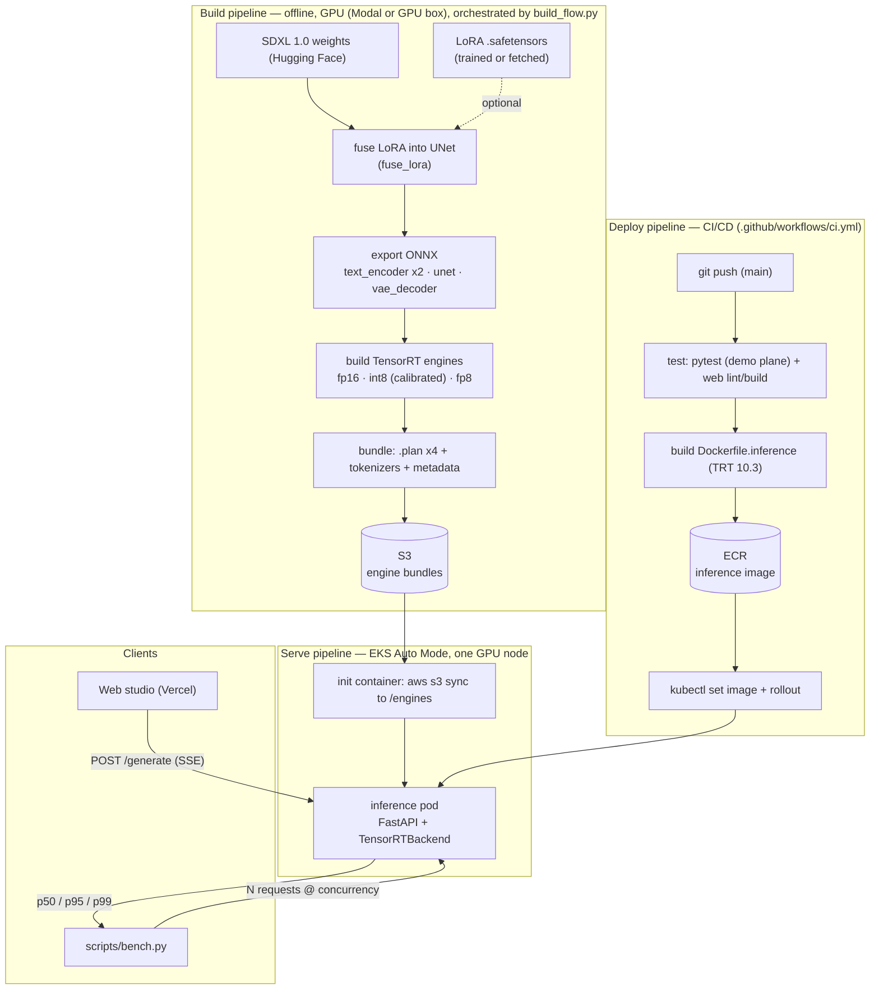
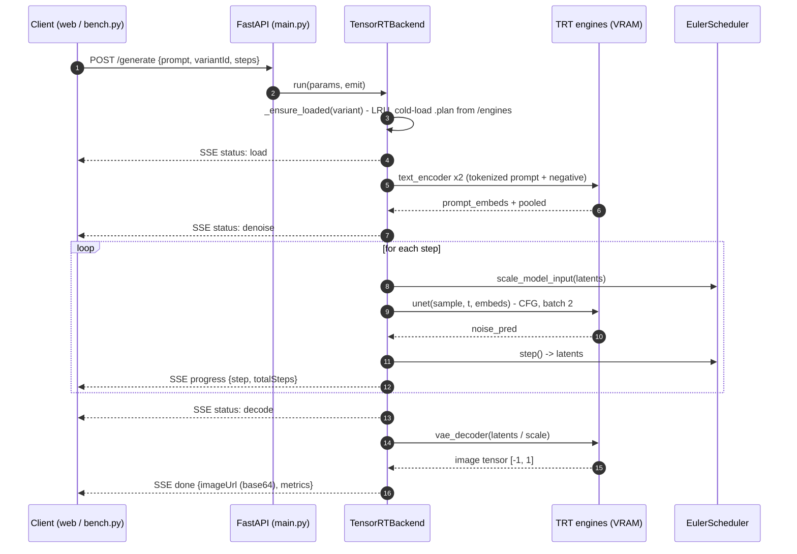
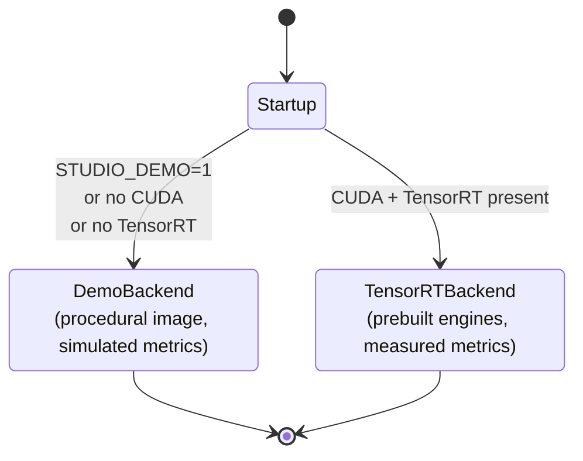

# ptq-gpu — pipeline diagrams

## 1. End-to-end pipeline (activity)

Offline **build** → **deploy** (CI/CD) → **serve** on a pinned GPU → **benchmark**.

## 2. Request flow (sequence)

One `POST /generate` on the real (TensorRT) plane.

## 3. Backend selection (state)

The service picks its plane at startup — the same product with or without a GPU.

